# 目录 - Content
- [1. 介绍](#1-介绍)
- [2. 依赖](#2-依赖)
- [3. 安装](#3-安装)
- [4. 使用](#4-使用)
- [5. 代码结构](#5-代码结构)


# 1. 介绍
这是一个基于SpringBoot的后端项目，使用了SpringBoot的一些特性，比如自动配置，自动装配，依赖注入等等。这个项目的目的是为了让大家更好的理解SpringBoot的一些特性，以及SpringBoot的一些使用方法。

# 2. 依赖
- JDK 1.8
- Maven 3.3.9
- SpringBoot 2.0.3.RELEASE
- MySQL 5.7.21
- Redis 3.2.100
- MongoDB 3.6.3
- RabbitMQ 3.7.4
- Elasticsearch 6.2.4
- Docker 18.03.1-ce

# 3. 安装
## 3.1. 安装JDK
- [JDK 1.8](http://www.oracle.com/technetwork/java/javase/downloads/jdk8-downloads-2133151.html)
- [Maven 3.3.9](http://maven.apache.org/download.cgi)
- [MySQL 5.7.21](https://dev.mysql.com/downloads/mysql/5.7.html#downloads)


# 5.代码结构
```bash
├── Backend_describe.md
├── README.md 
├── pom.xml
├── src
│   ├── main

```
# 6.页面解析与接口
## 6.1 首页
### 6.1.1 首页展示
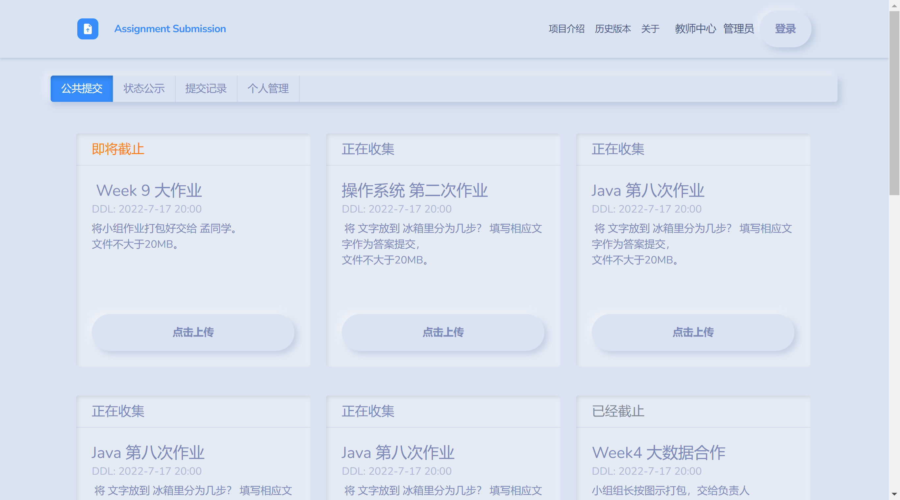
### 6.1.2 首页接口
完成于2022-9-26
```js
assigns:[
    {"assiid":1,"curriid":1,"ddl":"2022-07-25 17:14:47","permitanymous":1,"filenameverify":1,"updatedtime":"2022-07-25 17:15:18","userid":"21","brifename":"数据结构第六章","description":"请认真做作业，课后习题也做","filenamerule":"数据结构-学号-班级-学号"},
    {"assiid":2,"curriid":3,"ddl":"2022-07-25 17:47:08","permitanymous":0,"filenameverify":null,"updatedtime":"2022-07-25 17:47:17","userid":"22","brifename":"操作系统第一次","description":"认真做作业","filenamerule":"操作系统-学号"}]
```

## 6.2 提交状态展示
### 6.2.1 提交状态页展示
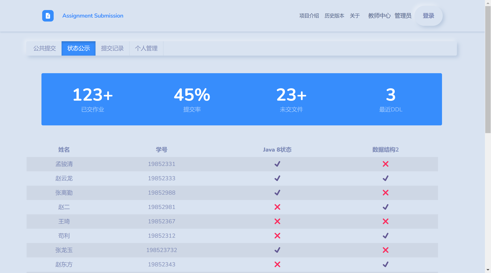
### 6.2.2 提交状态页接口
```js
{
    submits: 123;
    submitRatio: 0.45;
    unsubmitRatio: 83;
    nearestDDl: 0.12;
    submitList:[
        {name:"马丁及", stuId: "201721010", Java8: true, "数据结构": false, "操作系统": true, "计算机网络": true},
        {name:"王小军", stuId: "201721023", Java8: false, "数据结构": true, "操作系统": false, "计算机网络": false},
        {name:"张健康", stuId: "201721233", Java8: true, "数据结构": true, "操作系统": false, "计算机网络": true},
    ]
}
```

## 6.3 学生提交记录（需登录）
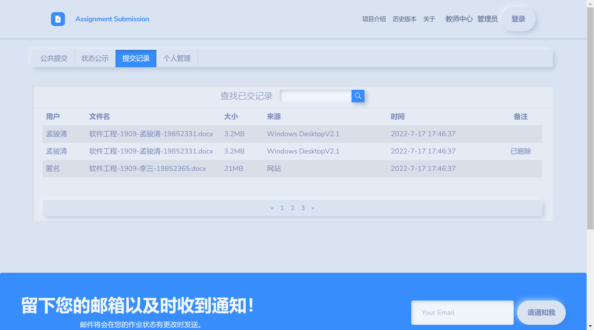

## 6.4 学生作业管理（需登录）
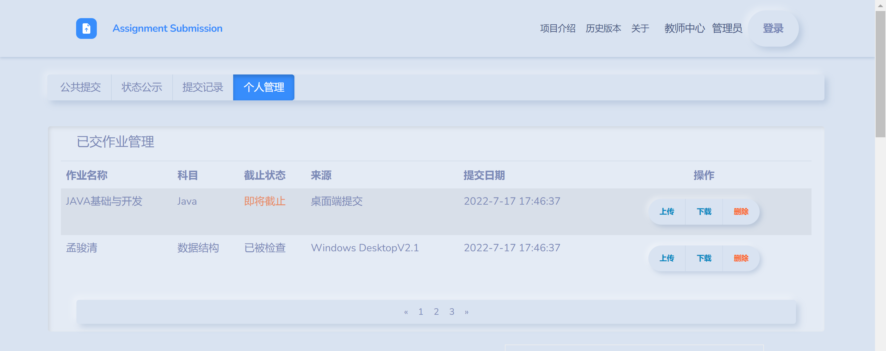
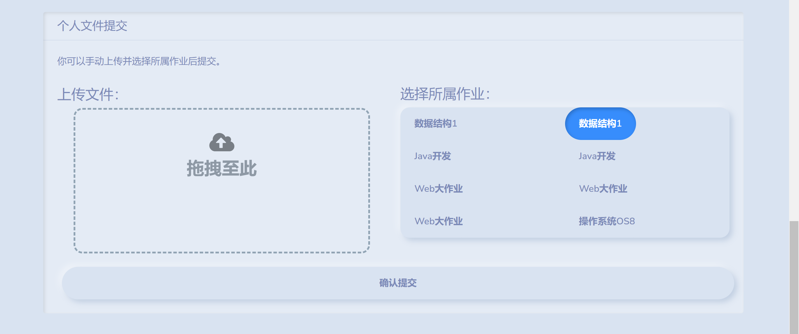

## 6.5 老师作业管理（需登录）
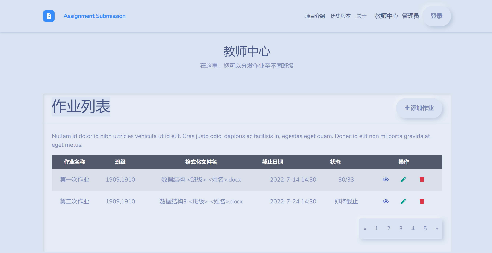
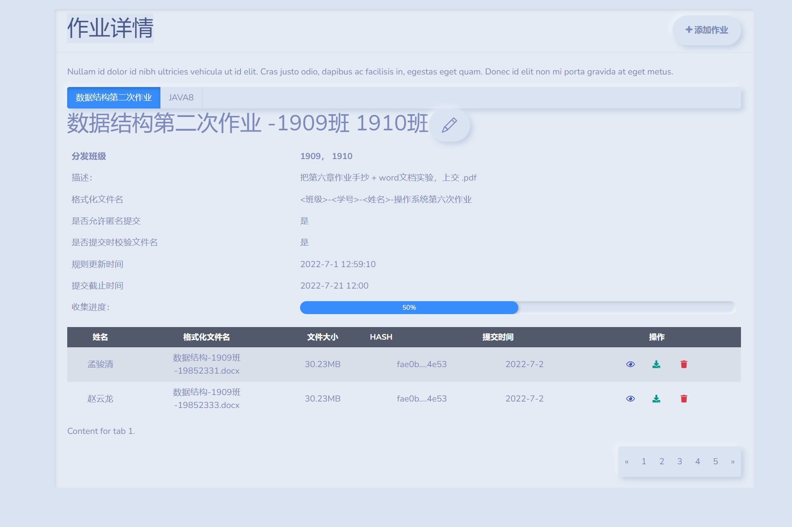

## 6.6 后台Dashboard（admin）
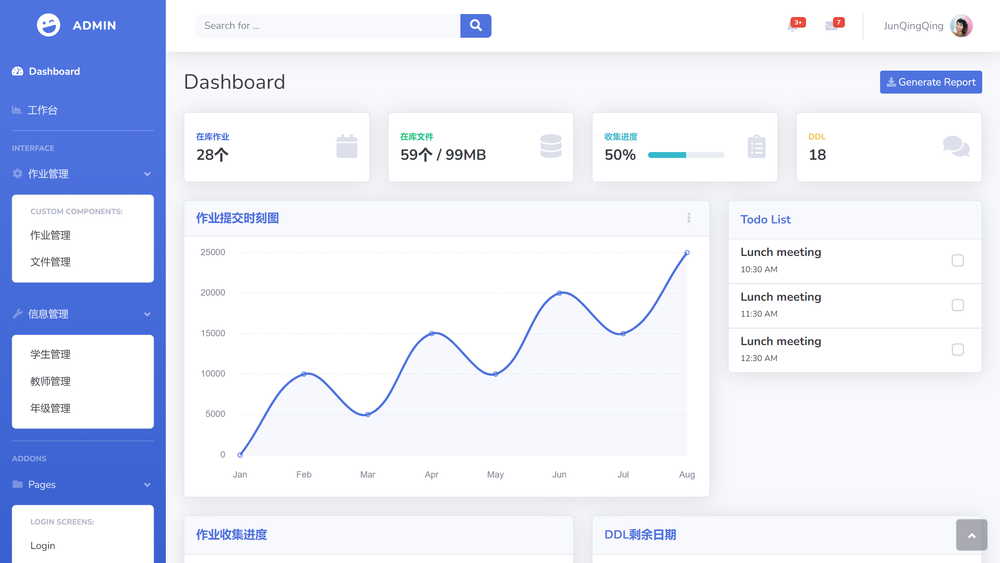
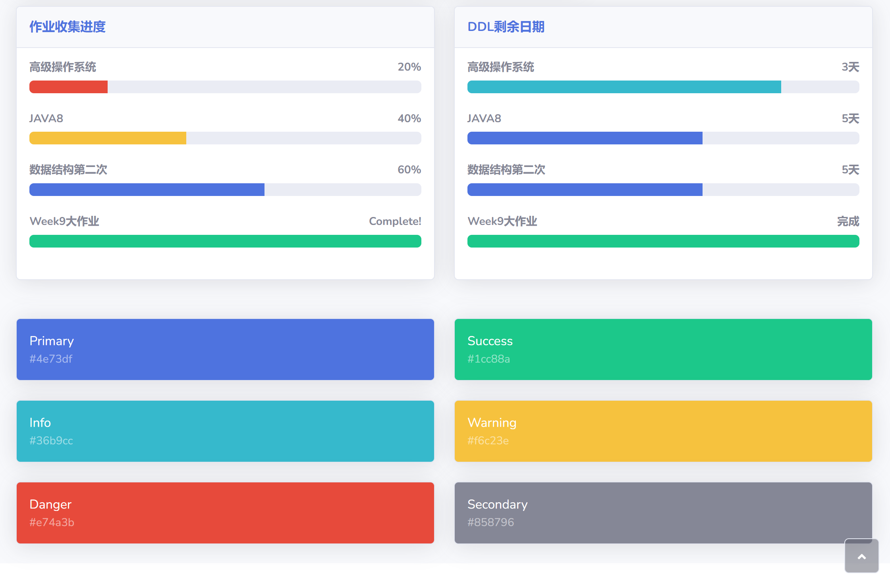
### 下面改名成最近提交记录
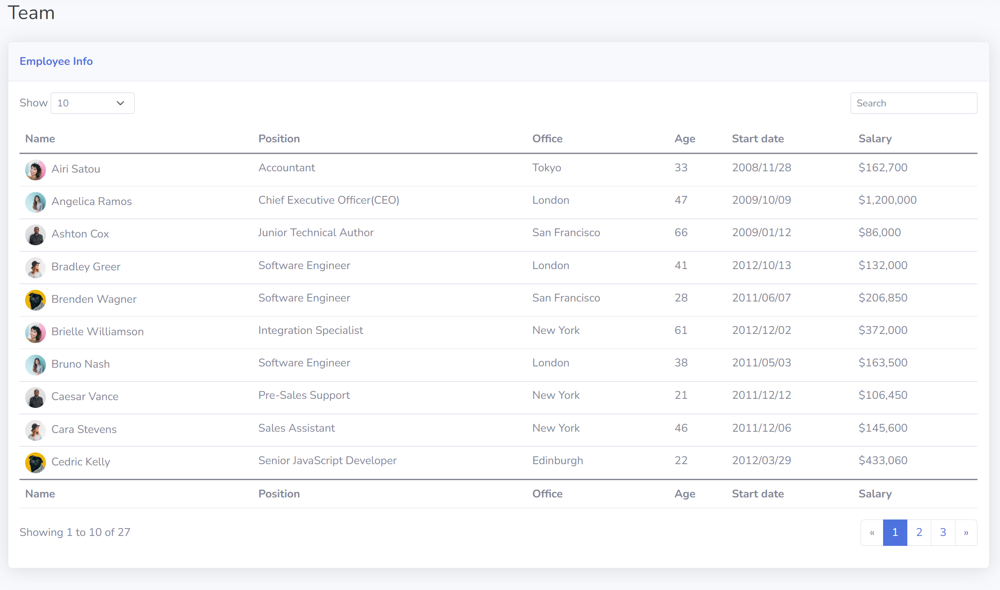

## 6.7 工作台（admin）
### TODO: 这个侧栏要改个名字
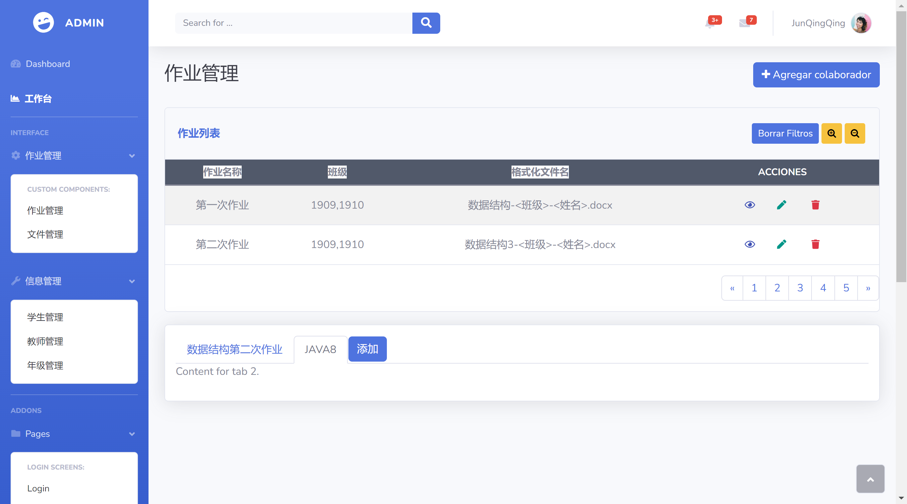
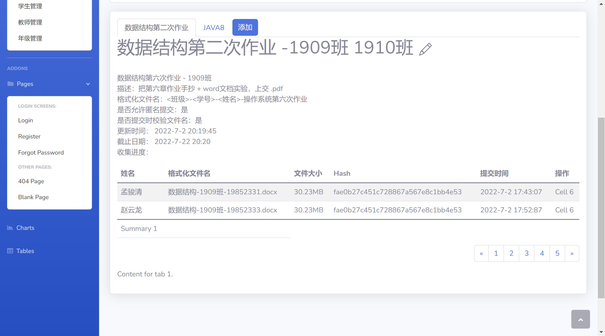

## 6.8 作业管理（admin）
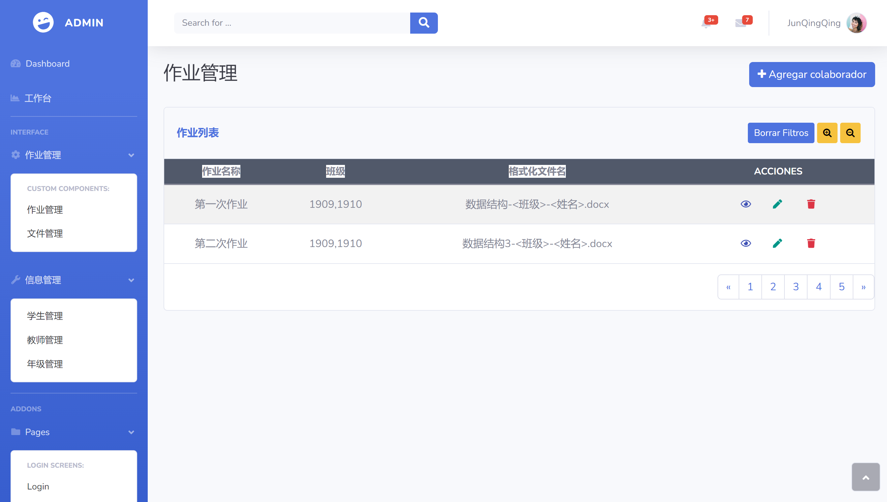

## 6.9 文件管理（admin）
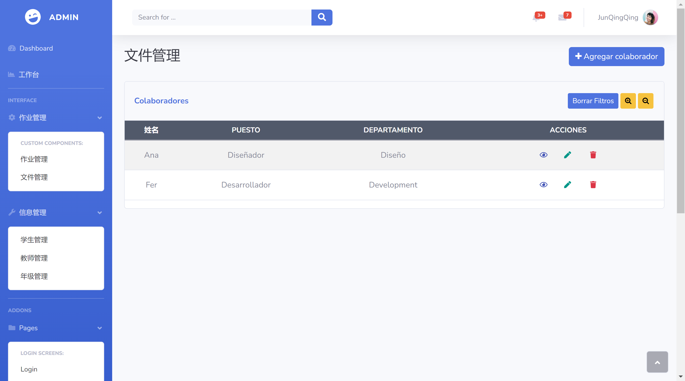

## 6.10 学生管理（admin）


## 6.11 教师管理（admin）
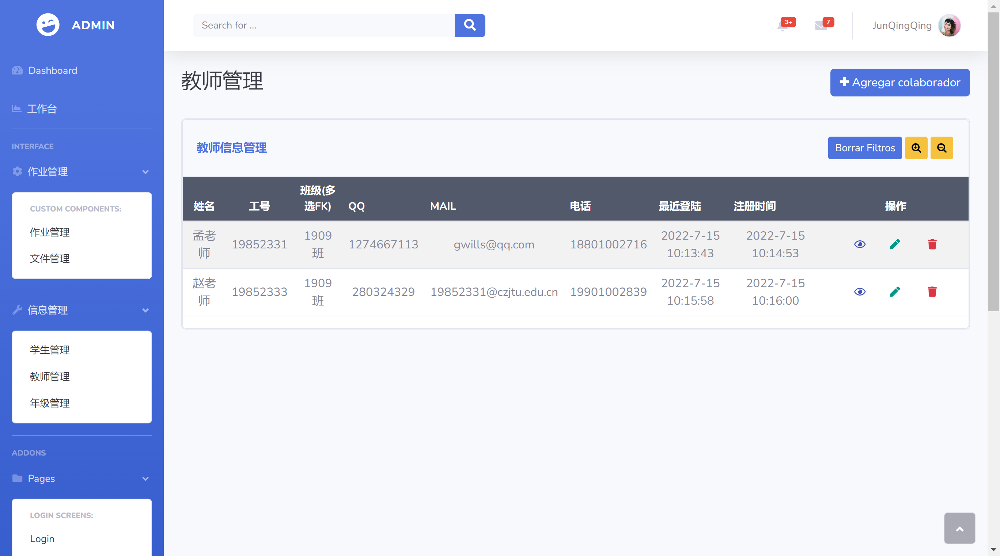

## 6.12 班级管理（admin）
要改名成班级管理


## 6.13 用户信息自定义
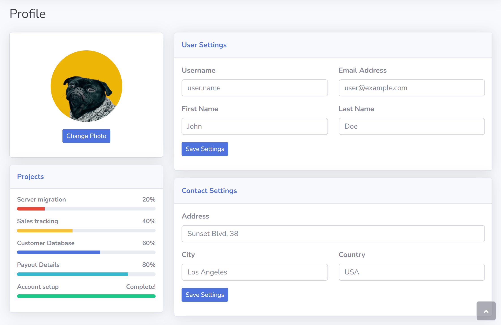

