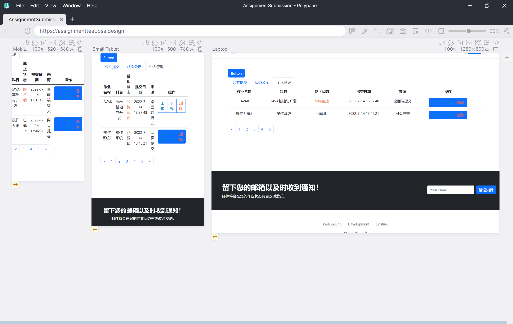

# 作业提交系统 介绍
### UML图设计与工具
### 技术栈涉及
### 代码管理与工具
### 代码测试与工具
### 迭代的历史版本（其他仓库的其他语言与平台的版本）

# The designed file structure for the project is as follows:
> Note: The following is not the latest version of the file structure.

## UML设计 (UML Diagram)
- draw.io
- PowerDesigner
- ER Diagram
- 

## UI设计 (UI Design)
- LanHu
- 
  https://mastergo.com/file/65280321600773?page_id=%3A10518
- Boostrap Studio
    
  - it can locally preview and publish preview
  - https://assignmenttest.bss.design/#

## 代码管理 (Code backup)
- GitHub

    GWillS163.com/GWillS163/AssignmentSubmission_Spring.git
- Git Tools

  Tower & Gitkraken
    
- Code review & Test
    GitGuardian
    MurphySec

## UI测试 (UI testing)
- CodeLint
- 

## TODO:
- [ ] 管理- [ ] 员发布文件规则，用户提交文件.不合规则名禁止提交。
- [ ] 按文件名归类
- [ ] 提前上交作业
- [ ] 一个登录用户指定规则名上传，其他用户可看到此规则‘由<张三>在2022年1月7日 12点59分 创建’）
### 前端功能
- [ ] js自动校验上传文件名，改名。
- [ ] 可查看已提交名单
- 根据规则，自动更名并提供下载
### 通知服务
  前置条件： 学校邮箱设置好
  >【通知】<xxx>老师下载了<xxx>所有作业文件，
  正在被查看。
  【警告】