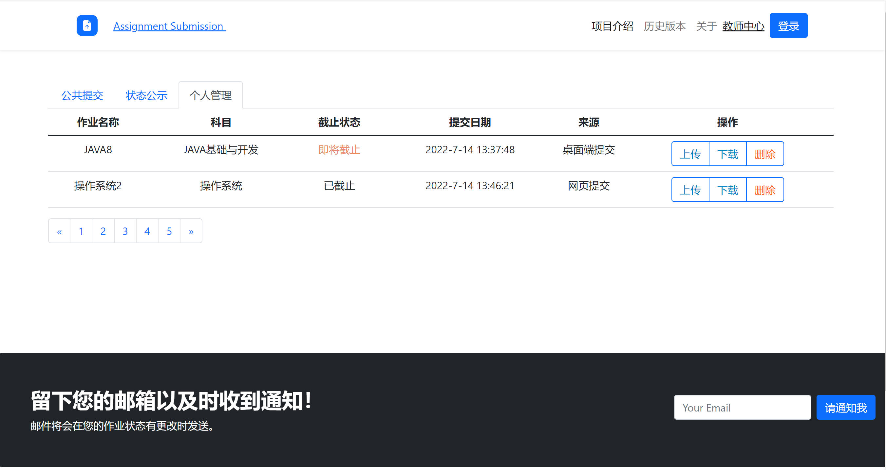
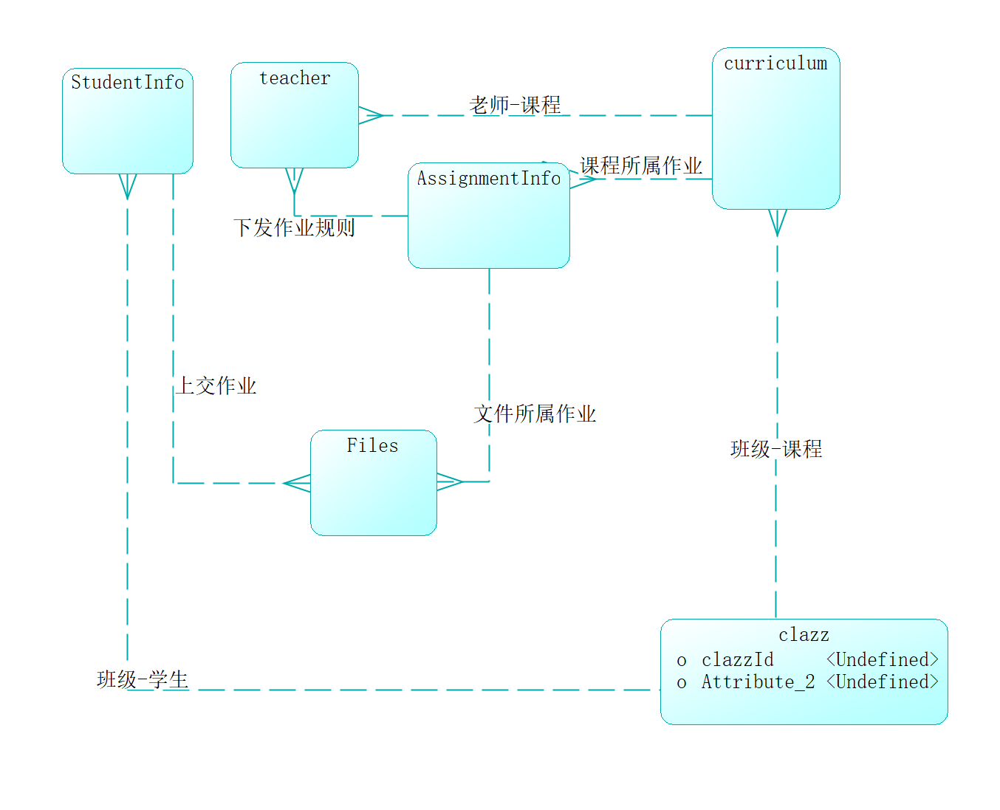
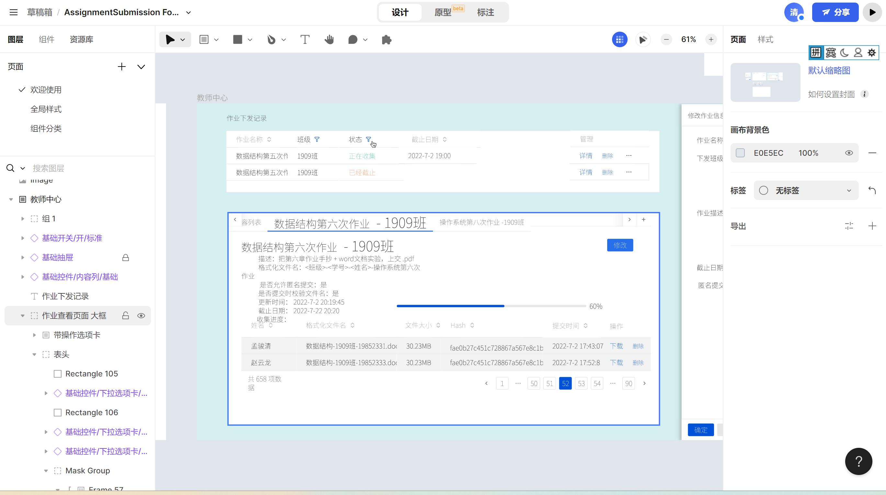
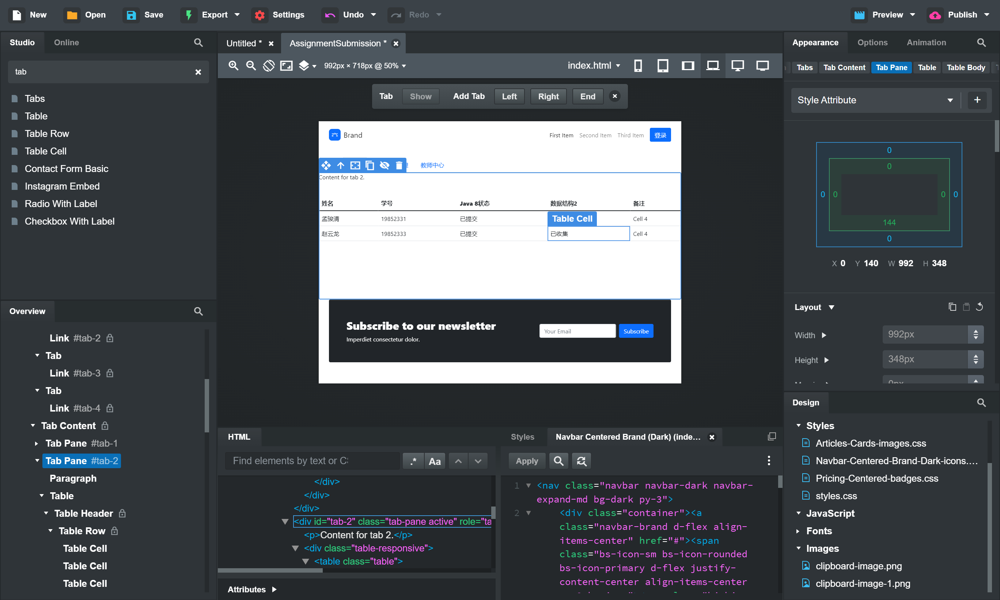
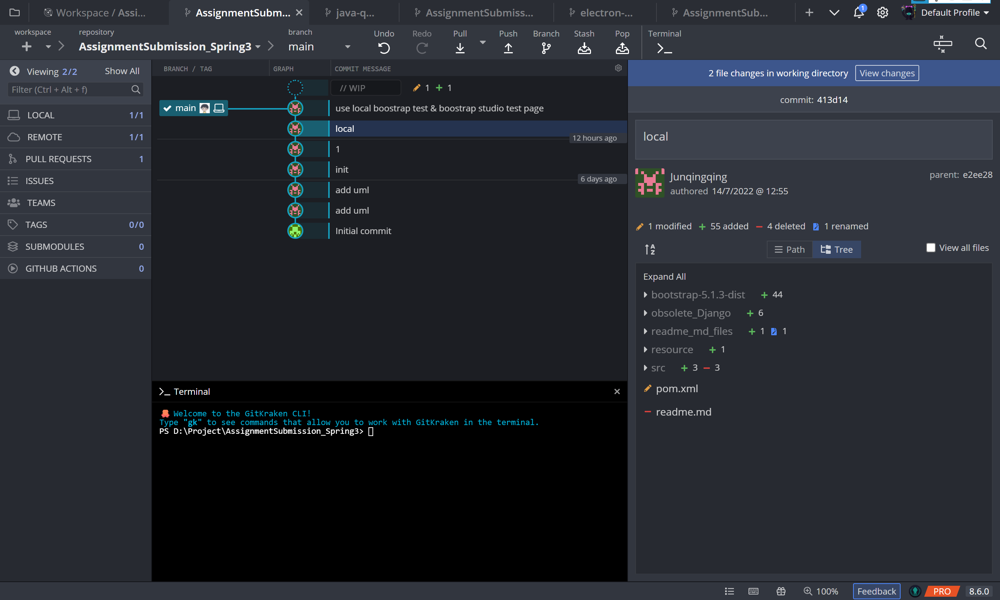

# 作业提交系统 介绍
### UML图设计与工具
### 技术栈涉及
### 代码管理与工具
### 代码测试与工具
### 迭代的历史版本（其他仓库的其他语言与平台的版本）

# The designed file structure for the project is as follows:
> Note: The following is not the latest version of the file structure.

## UML设计 (UML Diagram)
- draw.io
- PowerDesigner
- ER Diagram
- 

## UI设计 (UI Design)
- LanHu
- 
  https://mastergo.com/file/65280321600773?page_id=%3A10518
- Boostrap Studio
    
  - it can locally preview and publish preview
  - https://assignmenttest.bss.design/#

## 代码管理 (Code backup)
- GitHub

    GWillS163.com/GWillS163/AssignmentSubmission_Spring.git
- Git Tools

  Tower & Gitkraken
    
- Code review & Test
    GitGuardian
    MurphySec

<iframe frameborder="no" border="0" marginwidth="0" marginheight="0" width=330 height=450 src="//music.163.com/outchain/player?type=1&id=121002821&auto=1&height=430"></iframe>
