# 目录 - Content
- [1. 介绍](#1-介绍)
- [2. 依赖](#2-依赖)
- [3. 安装](#3-安装)
- [4. 使用](#4-使用)
- [5. 代码结构](#5-代码结构)


# 1. 介绍
这是一个基于SpringBoot的后端项目，使用了SpringBoot的一些特性，比如自动配置，自动装配，依赖注入等等。这个项目的目的是为了让大家更好的理解SpringBoot的一些特性，以及SpringBoot的一些使用方法。

# 2. 依赖
- 静态文件存储在本地：C:\Users\JunQingQing\AppData\Roaming\JetBrains\IntelliJIdea2021.2\javascript\extLibs


# 3. 运行
## 3.1. 安装DB-server
```shell
// 填入你本地的路径
cd cd ***\AssignmentSubmission_Spring3\resource\simpleFrontend\
json-server mockDB.json
```
- [JDK 1.8](http://www.oracle.com/technetwork/java/javase/downloads/jdk8-downloads-2133151.html)
- [Maven 3.3.9](http://maven.apache.org/download.cgi)
- [MySQL 5.7.21](https://dev.mysql.com/downloads/mysql/5.7.html#downloads)


# 5.代码结构
```bash
├── Frontend_describe.md
├── README.md 
├── pom.xml
├── src
│   ├── main

```
# 6.页面解析与接口
## 6.1 首页
### 6.1.1 首页展示
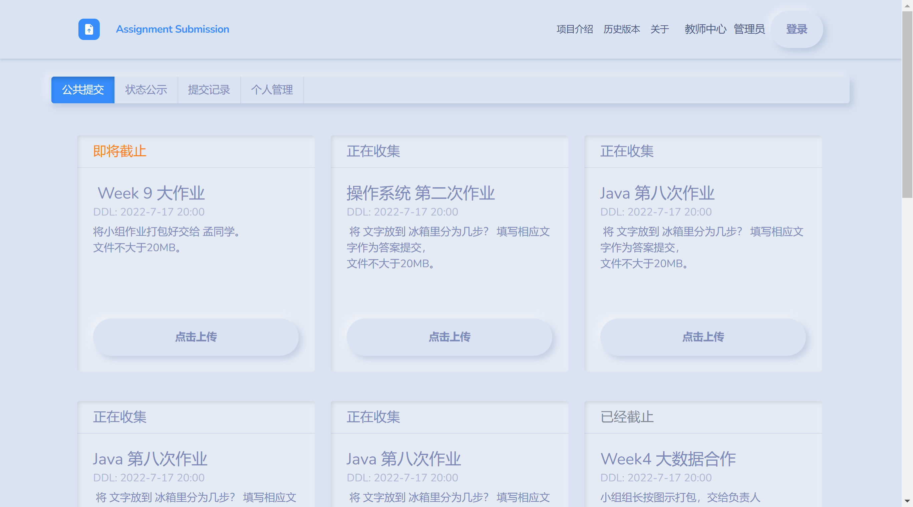
### 6.1.2 首页接口
完成于2022-9-26
```js
"indexAssigns":[
    {"id": 1,
      "assiId":1,
      "curriId":1,
      "ddl":"2022-07-25 17:14:47",
      "permitAnonymous":1,
      "filenameVerify":1,
      "updatedTime":"2022-07-25 17:15:18",
      "userid":"21",
      "briefName":"数据结构第六章",
      "description":"请认真做作业，课后习题也做",
      "fileNameRule":"数据结构-学号-班级-学号"},
    {"id": 2,
      "assiId":2,
      "curriId":1,
      "ddl":"2022-07-25 17:14:47",
      "permitAnonymous":1,
      "filenameVerify":1,
      "updatedTime":"2022-07-25 17:15:18",
      "userid":"21",
      "briefName":"数据结构第六章",
      "description":"请认真做作业，课后习题也做",
      "fileNameRule":"数据结构-学号-班级-学号"}
    ]
```

## 6.2 提交状态展示
### 6.2.1 提交状态页展示
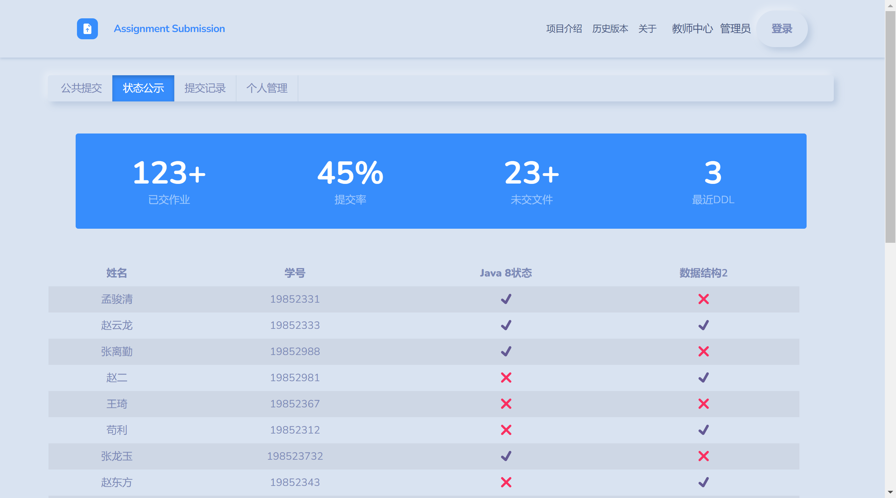
### 6.2.2 提交状态页接口
```js
"indexStatus":{
    submits: 123;
    submitRatio: 0.45;
    unsubmitRatio: 83;
    nearestDDl: 0.12;
    submitList:[
        {name:"马丁及", stuId: "201721010", Java8: true, "数据结构": false, "操作系统": true, "计算机网络": true},
        {name:"王小军", stuId: "201721023", Java8: false, "数据结构": true, "操作系统": false, "计算机网络": false},
        {name:"张健康", stuId: "201721233", Java8: true, "数据结构": true, "操作系统": false, "计算机网络": true},
    ]
}
```

## 6.3 学生提交记录（需登录）
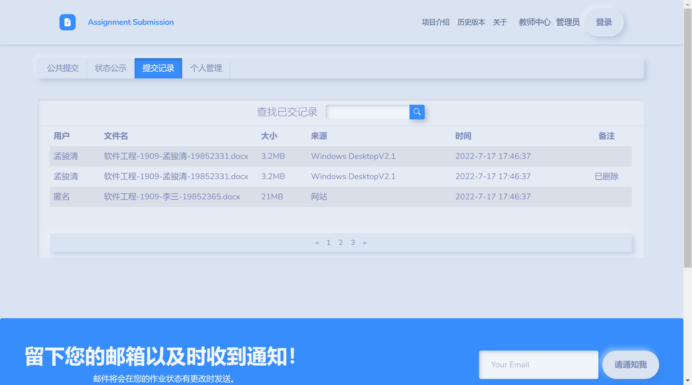
```js
"indexRecord": [
    {"name":"马丁及",
        "assiId":1,
        "assiBriefName":"数据结构第一次作业",
        "fileName": "软件工程1999-马丁及-19852999.docx",
        "source": "Windows Desktop V2.1",
        "DateTime": "2022-10-15 19:50:21",
        "comment": "已删除"},
    {"name":"马丁及",
        "assiId":2,
        "assiBriefName":"数据结构第一次作业",
        "fileName": "软件工程1999-马丁及-19852999.docx",
        "source": "Windows Desktop V2.1",
        "DateTime": "2022-10-15 19:50:21",
        "comment": "已删除"},
    {"name":"马丁及",
        "assiId":1,
        "assiBriefName":"数据结构第一次作业",
        "fileName": "软件工程1999-马丁及-19852999.docx",
        "source": "Windows Desktop V2.1",
        "DateTime": "2022-10-15 19:50:21",
        "comment": "已删除"}
],
```
## 6.4 学生作业管理（需登录）
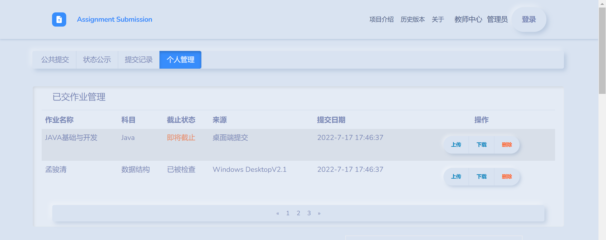

```js
{
    submitList:[
        {assiName:"Java基础与开发3", curriName:"Java基础", assiStatus:"即将截止", source:"桌面端提交", uploadTime:"2022-10-15 20:05:47"},
        {assiName:"操作系统第一次作业", curriName:"操作系统", assiStatus:"已截止", source:"windows Desktop V3.2", uploadTime:"2022-10-15 20:05:47"},
        {assiName:"Java基础与开发", curriName:"Java基础", assiStatus:"已截止", source:"桌面端提交", uploadTime:"2022-11-15 20:05:47"},
    ]
}
```

## 6.5 老师作业管理（需登录）
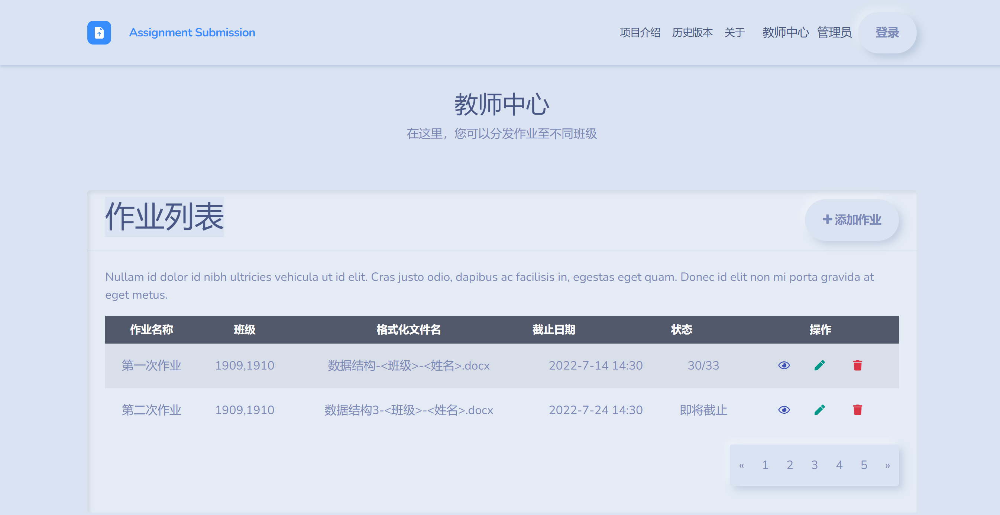
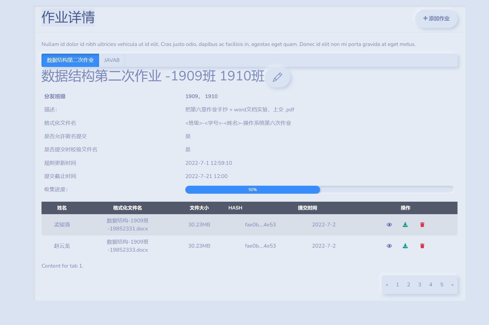
```js
{
    teacherAssis:[
        // assiName 默认前端生成 科目+10-15作业.
        {assiId: 1, assiName: "第一次作业", clazz:[1909, 1910], formatFileName: "数据结构1-<班级>-<姓名>", ddl:"2022-10-15 20:20:41", status: "30/33"},
        {assiId: 2, assiName: "第二次作业", clazz:[1909, 1910], formatFileName: "数据结构2-<班级>-<姓名>", ddl:"2022-10-15 20:20:41", status: "已收齐"}
    ],
    // 查询出来相关的作业 (收集详情)
    collectInfo:{
        ddl: "2022-10-15 20:28:46"
        collectNums: 30,
        collectMax: 33,
        fileList:[
            {fileId: 1, userName: "马丁及", fileName: "数据结构1-1909-马丁及.docx", fileSize: 320220, fileHash: "ec439a89b9e98de", source: "Windows Desktop V2.1", DateTime: "2022-10-15 19:50:21", comment: "已删除"},
            {fileId: 2, userName: "马丁及", fileName: "数据结构1-1909-马丁及.docx", fileSize: 320220, fileHash: "ec439a89b9e98de", source: "Windows Desktop V2.1", DateTime: "2022-10-15 19:50:21", comment: "已删除"},
        ]
    }
    
    
}
```

## 6.6 后台Dashboard（admin）

```js
{
    collectingAssis: 28,
    storingFiles: 59,
    collectingProgress: 0.5,
    DDL: 18, // 将会截止的
    // 提交图表 - 效果图和文档不一样
    submitChart: {
        xAxis: ["2022-10-15", "2022-10-16", "2022-10-17", "2022-10-18", "2022-10-19", "2022-10-20", "2022-10-21"],
        series: [
            {name: "1909", data: [10, 20, 30, 40, 50, 60, 70]},
            {name: "1910", data: [10, 20, 30, 40, 50, 60, 70]},
            {name: "1911", data: [10, 20, 30, 40, 50, 60, 70]},
            {name: "1912", data: [10, 20, 30, 40, 50, 60, 70]},
            {name: "1913", data: [10, 20, 30, 40, 50, 60, 70]},
            {name: "1914", data: [10, 20, 30, 40, 50, 60, 70]},
            {name: "1915", data: [10, 20, 30, 40, 50, 60, 70]},
            {name: "1916", data: [10, 20, 30, 40, 50, 60, 70]},
            {name: "1917", data: [10, 20, 30, 40, 50, 60, 70]},
            {name: "1918", data: [10, 20, 30, 40, 50, 60, 70]},
            {name: "1919", data: [10, 20, 30, 40, 50, 60, 70]},
            {name: "1920", data: [10, 20, 30, 40, 50, 60, 70]},
            {name: "1921", data: [10, 20, 30, 40, 50, 60, 70]},
            {name: "1922", data: [10, 20, 30, 40, 50, 60,
},
    todoList:[
            {todoId: 1, title: "Lunch meeting1", dateTime:"2022-10-15 20:20:41", status: false},
            {todoId: 2, title: "Lunch meeting2", dateTime:"2022-10-18 20:33:41", status: false},
            {todoId: 3, title: "Lunch meeting3", dateTime:"2022-10-11 10:18:41", status: false},
        ]
```
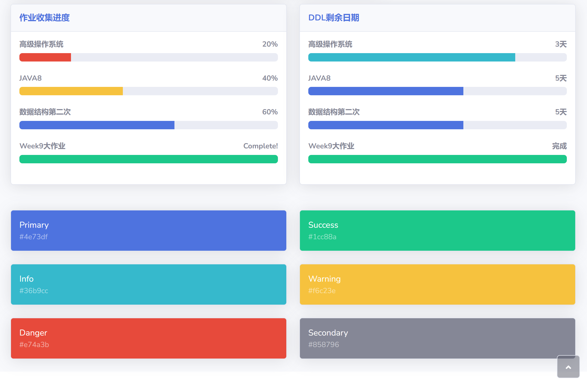
```js
{
    assiCollectSummarize:[
        {assiId: 1, assiName: "高级操作系统", collectNums: 7, collectMax: 33, ddl: "2022-10-15 20:43:27"},
        {assiId: 2, assiName: "Java8", collectNums: 13, collectMax: 33, ddl: "2022-10-15 20:43:38"},
        {assiId: 3, assiName: "数据第二次作业", collectNums: 20, collectMax: 33, ddl: "2022-12-15 20:43:27"},
        {assiId: 4, assiName: "数据第二次作业", collectNums: 20, collectMax: 33, ddl: "2022-11-15 20:44:02"},
    ]
}
```
### 下面改名成最近提交记录

```js
{
    recentSubmit:[
        {assiId: 1, fileId:1, userName: "马丁及", fileName: "数据结构1-1909-马丁及.docx", fileSize: 320220, source: "Windows Desktop V2.1", DateTime: "2022-10-15 19:50:21", comment: "已删除"},
        {assiId: 1, fileId:3, userName: "马丁及", fileName: "数据结构1-1909-马丁及.docx", fileSize: 320220, source: "Windows Desktop V2.1", DateTime: "2022-10-15 19:50:21", comment: "已删除"},
        {assiId: 3, fileId: 5, userName: "马丁及", fileName: "数据结构1-1909-马丁及.docx", fileSize: 320220, source: "Windows Desktop V2.1", DateTime: "2022-10-15 19:50:21", comment: "已删除"},
        {assiId: 1, fileId: 8, userName: "马丁及", fileName: "数据结构1-1909-马丁及.docx", fileSize: 320220, source: "Windows Desktop V2.1", DateTime: "2022-10-15 19:50:21", comment: "已删除"},
        {assiId: 1, fileId: 9, userName: "马丁及", fileName: "数据结构1-1909-马丁及.docx", fileSize: 320220, source: "Windows Desktop V2.1", DateTime: "2022-10-15 19:50:21", comment: "已删除"},
    ]
}
```

## 6.7 工作台（admin）
### TODO: 这个侧栏要改个名字
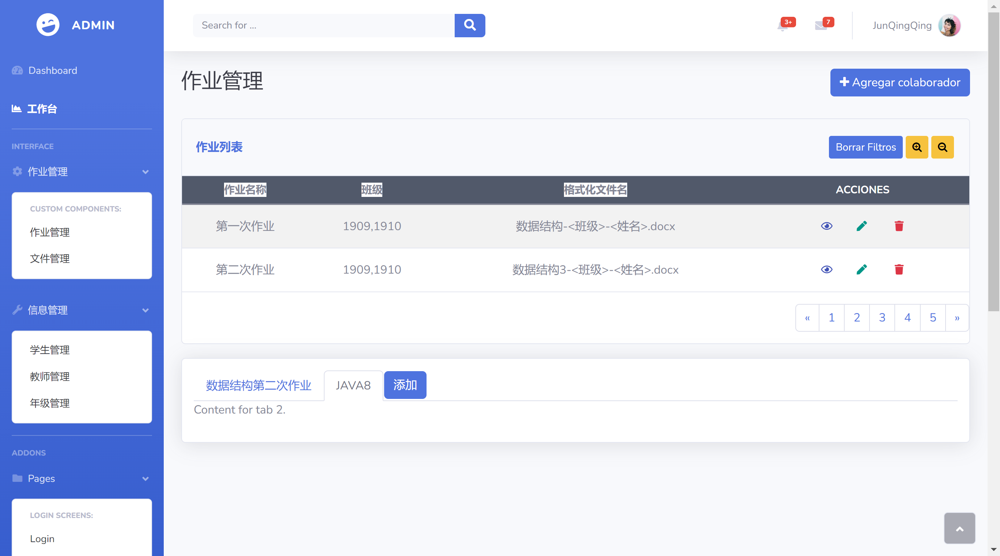
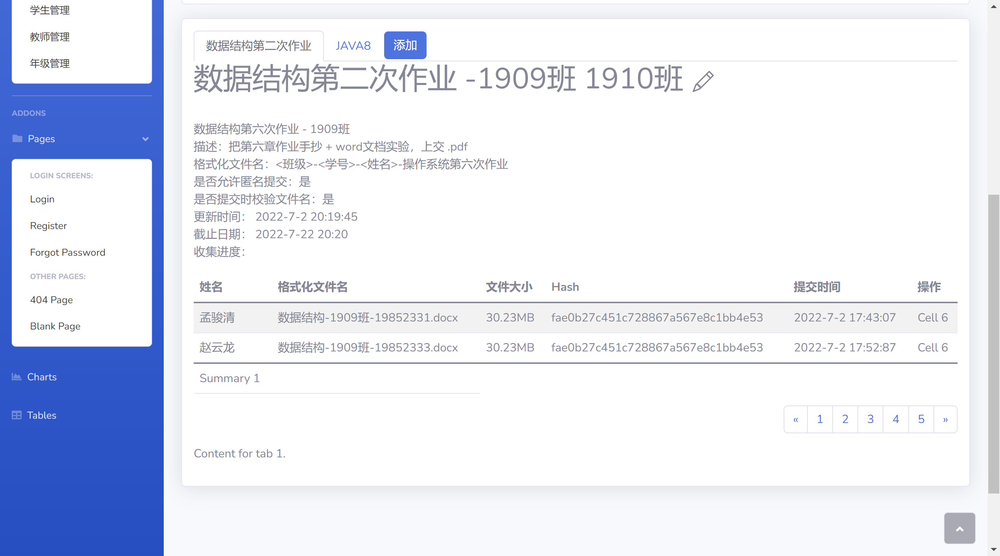
```js
{
    // 教师作业分发
    teacherAssis:[
        {assiId: 1, 
        assiName: "数据第一次作业", 
        clazz: [1909, 1910], 
        formatName: "数据结构-<班级>-<姓名>", 
        ddl: "2022-10-15 22:17:49" },
        {assiId: 2, assiName: "数据第二次作业", clazz: [1909, 1910], formatName: "数据结构-<班级>-<姓名>", ddl: "2022-10-15 22:17:49" },
    ]
}
```
## 6.8 作业管理（admin）
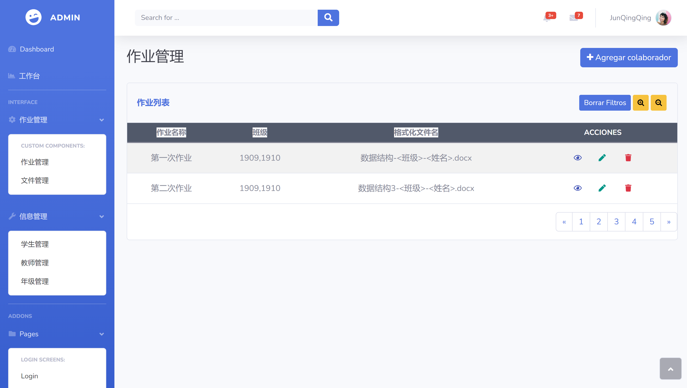
```js
{
    teacherAssis:[
        {assiId: 1, assiName: "第一次作业", clazz: [1909, 1910], formatName: "数据结构-<班级>-<姓名>", ddl: "2022-10-15 22:17:49" },
        {assiId: 2, assiName: "第二次作业", clazz: [1909, 1910], formatName: "数据结构-<班级>-<姓名>", ddl: "2022-10-15 22:17:49" },
    ]
}
```
## 6.9 文件管理（admin）
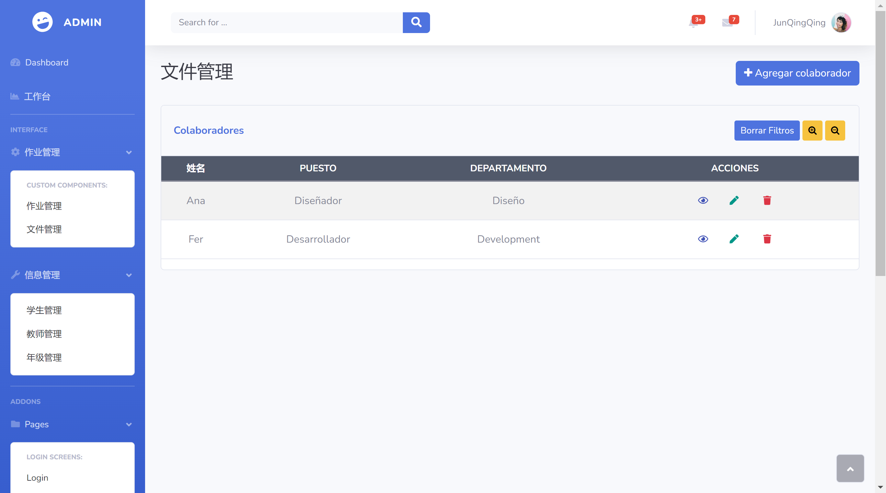
```js
{
    fileList:[
        {fileId: 1, fileName: "数据结构1-1909-马丁及.docx", fileSize: 320220, source: "Windows Desktop V2.1", DateTime: "2022-10-15 19:50:21", comment: "已删除"},
        {fileId: 2, fileName: "数据结构1-1909-马丁及.docx", fileSize: 320220, source: "Windows Desktop V2.1", DateTime: "2022-10-15 19:50:21", comment: "已删除"},
        {fileId: 3, fileName: "数据结构1-1909-马丁及.docx", fileSize: 320220, source: "Windows Desktop V2.1", DateTime: "2022-10-15 19:50:21", comment: "已删除"},
        {fileId: 4, fileName: "数据结构1-1909-马丁及.docx", fileSize: 320220, source: "Windows Desktop V2.1", DateTime: "2022-10-15 19:50:21", comment: "已删除"},
        {fileId: 5, fileName: "数据结构1-1909-马丁及.docx", fileSize: 320220, source: "Windows Desktop V2.1", DateTime: "2022-10-15 19:50:21", comment: "已删除"},
        {fileId: 6, fileName: "数据结构1-1909-马丁及.docx", fileSize: 320220, source: "Windows Desktop V2.1", DateTime: "2022-10-15 19:50:21", comment: "已删除"},
        {fileId: 7, fileName: "数据结构1-1909-马丁及.docx", fileSize: 320220, source: "Windows Desktop V2.1", DateTime: "2022-10-15 19:50:21", comment: "已删除"}
```
## 6.10 学生管理（admin）

```js
{
    studentList:[
        {stuId: 1, stuName: "马丁及", clazz: 1909, qq: "129434343", email:"128329@qq.com", phone:"129032032", lastLogin:"2022-10-16 11:06:46", registerTime:"2022-10-16 11:06:58"},
        {stuId: 2, stuName: "马2", clazz: 1909, qq: "129434343", email:"128329@qq.com", phone:"129032032", lastLogin:"2022-10-16 11:06:46", registerTime:"2022-10-16 11:06:58"},
        {stuId: 3, stuName: "马3", clazz: 1909, qq: "129434343", email:"128329@qq.com", phone:"129032032", lastLogin:"2022-10-16 11:06:46", registerTime:"2022-10-16 11:06:58"},
}
```


## 6.11 教师管理（admin）
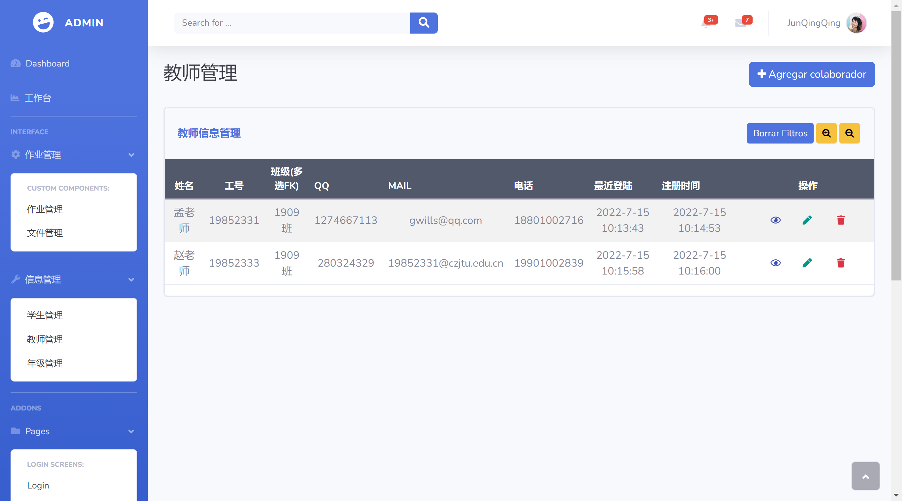
```js
{
    teacherList:[
        {teaId: 1, teaName: "马丁及", qq: "129434343", email:"128203@qqcom", lastLogin:"2022-10-16 11:06:46", registerTime:"2022-10-16 11:06:58"},
        {teaId: 2, teaName: "马丁及2", qq: "3313243", email:"128203@qqcom", lastLogin:"2022-10-16 11:06:46", registerTime:"2022-10-16 11:06:58"},
    ]
}
```
## 6.12 班级管理（admin）
要改名成班级管理

```js
{
    classList:[
        {classId: 1, className: "1909", stuNum: 30, teaNum: 2},
        {classId: 2, className: "1910", stuNum: 30, teaNum: 2},
    ]
}
```
## 6.13 用户信息自定义
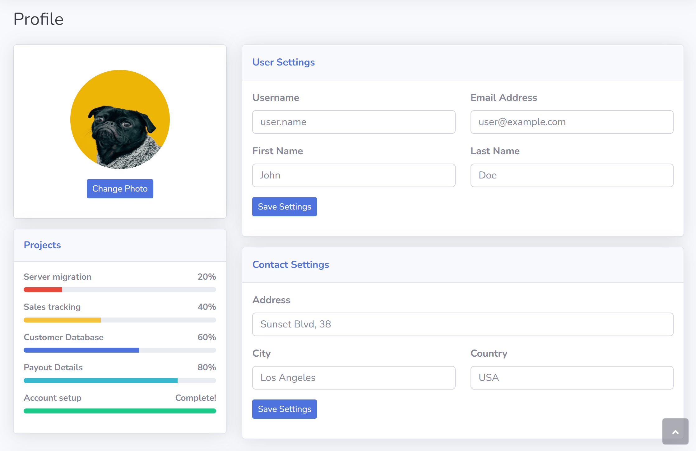
```js
{
    userInfo:{
        userId: 1,
            userName
    :
        "马丁及",
            userRole
    :
        "student",
            userAvatar
    :
        "https://img2.baidu.com/it/u=1818181818,1818181818&fm=26&fmt=auto&gp=0.jpg",
            userPhone
    :
        "1818181818",
            userQQ
    :
        "1818181818",
            userEmail
    :
        "fsdf",
    }
}
```
